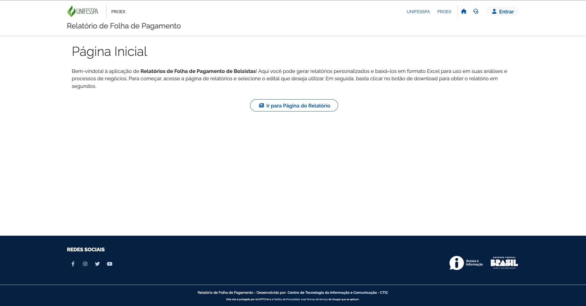

# FolhaBolsista

> Aplicação de relatório de Folha de Pagamento para PROEX.

[![Docker Version][docker-image]][docker-url]
[![Git Version][git-image]][git-url]
[![Node Version][node-image]][node-url]
[![React Version][react-image]][react-url]
[![Next Version][next-image]][next-url]
[![Yarn Version][yarn-image]][yarn-url]

Esta aplicação tem o intuito de agilizar a geração de relatórios de folha de pagamento para a PROEX e utiliza tecnologias atuais como o Next, fazendo os processamentos necessários no servidor.



## 🚀 Inicializar a Aplicação Localmente

**Clonar Repositório:**

```sh
git clone git@gitlab.unifesspa.edu.br:disi/folhabolsista.git
```

**Entrar na Pasta do Projeto:**

```sh
cd folhabolsista
```

**Criar Arquivo com as Variáveis de Ambiente:**

```sh
cp .env.dist .env.local
```

<hr>

### 🐳 Subir aplicação com Docker

**Subir o container:**

```sh
docker compose up
```

> Este comando automaticamente faz o build do container quando for utilizado pela primeira vez.

Obs.: Para simular o ambiente de desenvolvimento ou de produção, apenas deve-se alterar as seguintes linhas do docker-compose.yml:

Produção:

    target: runner
    command: yarn start

Desenvolvimento:

    target: dependencies
    command: node server.js

Obs.: Caso seja instalado alguma nova dependência ou seja alterado o ambiente para produção ou desenvolvimento, deve-se fazer o build da aplicação novamente:

```sh
docker compose up --build
```

<hr>

### 🧶 Subir aplicação na máquina

Para subir a aplicação na máquina, deve-se garantir que se tenha as dependências corretas instaladas na sua máquina.

#### 📌 Instalação de Dependências

**Instalar Node:**

```sh
brew install node
```

**Instalar Yarn:**

```sh
npm install --global yarn
```

**Instalar Bibliotecas no Projeto:**

```sh
yarn
```

**Inicializar Aplicação:**

```sh
yarn dev
```

<hr>

## 💻 IDEs Sugeridas

-    Visual Studio Code
-    WebStorm

<hr>

## 📝 Observações

-   Aplicação utiliza [Padrão Visual do GOV](https://www.gov.br/ds/home).
-   Criada com [React](https://react.dev/) utilizando o [Next](https://nextjs.org/docs).
-   Utilize **Git Flow** para gerenciamento do repositório.

<hr>

## 🎁 Gerenciar Git Flow:

**Iniciar gitflow:**

```sh
git flow init -d
```

**Iniciar feature:**

```sh
git flow feature start <nome_da_feature>
```

**Finalizar feature:**

```sh
git flow feature finish <nome_da_feature>
```

<hr>


<!-- Links e imagens -->
[docker-image]: https://img.shields.io/badge/docker-%3E%3D20.10-blue?style=flat-square&logo=docker
[docker-url]: https://www.docker.com/

[git-image]: https://img.shields.io/badge/git-%3E%3D2.30-red?style=flat-square&logo=git
[git-url]: https://git-scm.com/

[node-image]: https://img.shields.io/node/v/next.svg?style=flat-square&logo=nodedotjs
[node-url]: https://nodejs.org/pt-br

[next-image]: https://img.shields.io/badge/next-13.4.1-blueviolet?style=flat-square&logo=nextdotjs
[next-url]: https://www.npmjs.com/package/next

[react-image]: https://img.shields.io/badge/react-18.2.0-blue?style=flat-square&logo=react
[react-url]: https://www.npmjs.com/package/react

[yarn-image]: https://img.shields.io/badge/yarn-%3E%3D1.20-blue?style=flat-square&logo=yarn
[yarn-url]: https://www.npmjs.com/package/yarn
